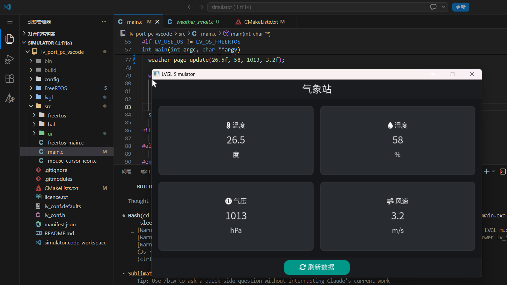
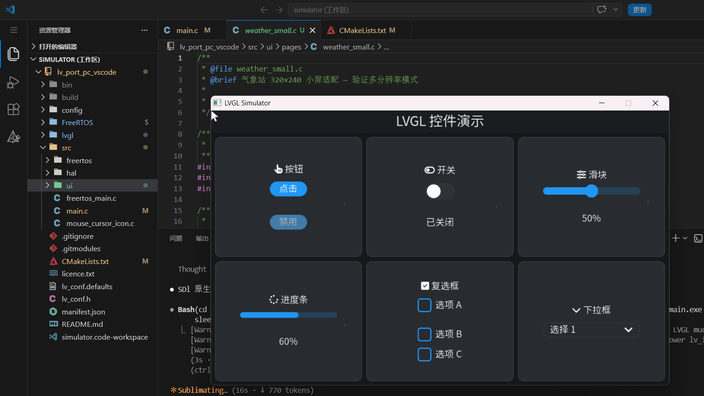

# LVGL UI Generator — Claude Code Skill

LVGL v9 UI 代码生成 skill，覆盖**需求分析 → 布局设计 → 主题配置 → 字体生成 → C 代码生成 → 构建集成 → 部署**全流程。

## 适用平台

- LVGL v9 所有平台：嵌入式 Linux (fbdev/evdev)、ESP32、PC 模拟器等
- ARM 交叉编译（已验证 GEC6818 / S5P6818）
- 800×480 等中小分辨率 TFT/LCD

## 文件结构

```
lvgl-ui-generator/
├── SKILL.md                             ← 主文档（触发 → 分类 → 流程 → 自检）
├── README.md                            ← 本文件
└── references/
    ├── lvgl-v9-api-cheatsheet.md        ← 控件 API 签名速查
    ├── coding-conventions.md            ← 代码模板 + 命名约定 + v8→v9
    ├── theme-system.md                  ← 主题系统 + 深浅色陷阱
    ├── scrollbar-guide.md               ← 滚动条场景决策树 + 自检
    ├── font-pipeline.md                 ← 5 种方案 + FA6 合并字体
    ├── flex-grid-guide.md               ← Flex vs Grid + 决策树 + 陷阱
    ├── interaction-patterns.md          ← 事件 / 工厂函数 / 状态管理
    ├── icon-display-guide.md            ← 62 LV_SYMBOL + FA6 两级方案
    ├── screen-navigation.md             ← 栈/Tab/生命周期/动画
    ├── multi-dpi-guide.md               ← lv_pct/lv_dpx/Grid FR/断点
    ├── preview-workflow.md              ← PC 预览工作流
    └── common-errors.md                 ← 16 条实战错误速查

preview/                                 ← 🆕 一键 SDL 预览工程
    ├── setup.ps1 / setup.sh            ← 环境自动配置
    ├── CMakeLists.txt                   ← 最小构建
    └── main.c                           ← 模板入口

## 设计理念

### 三明治结构

```
SKILL.md          (~160 行)  每次触发加载 — 程序性指令
references/       (~2000 行) 按需加载 — 参考数据
```

- SKILL.md 只包含**触发条件 + 请求分类 + 核心原则 + 关键决策 + 自检清单**
- 详细 API、代码模板、常见错误放在 references/，由模型按需读取
- 请求分类表根据用户意图路由到不同执行路径，避免每请求必跑全流程

### Token 效率

| 指标 | 重构前 | 重构后 |
|------|--------|--------|
| SKILL.md 行数 | 565 | ~160 |
| 每次触发 Token | ~15K | ~4K |
| 参考文档命中 | N/A（全量加载） | 按需 ~2-3 个文件 |

## 效果预览

| 气象站数据面板 | 控件演示 (自适应分辨率) |
|---------------|---------------------|
|  |  |

---

## 能解决什么问题

| 模块 | 覆盖 |
|------|------|
| **布局** | Flex vs Grid 选择指南 + 决策树 + 多分辨率自适应 |
| **主题** | `lv_theme_default_init` 全局风格 + 深浅色切换 + 陷阱 |
| **滚动条** | 场景分级决策树 + 根因分析 + 工厂函数 + 自检 |
| **图标** | 62 LV_SYMBOL 速查 + FA6 合并字体（2000+ 图标可选） |
| **中文** | 5 种字体方案对比 + lv_font_conv + FA6 合并 + WSL 1 workaround |
| **导航** | 屏幕栈 push/pop + TabView + 生命周期 + 切换动画 |
| **交互** | snprintf 动态文本 + 事件回调 + 工厂函数 + 状态管理 |
| **错误** | 16 条实战错误（现象 → 根因 → 修复） |

## 安装

```bash
# 克隆到 Claude Code 的 skills 目录
git clone https://github.com/ajhdkjsahd/lvgl-ui-generator.git \
  ~/.agents/skills/lvgl-ui-generator
```

在 Claude Code 中输入 `lvgl` 或描述 UI 需求即可自动触发。

## 参考

- [LVGL 官方文档](https://docs.lvgl.io/)
- LVGL 源码内置符号：`lvgl/include/lvgl/font/lv_symbol_def.h`
